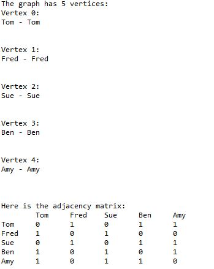

# This is a sample undirected graph with an adjacency matrix that makes vertices with edges connecting them

 

## The vertices in this graph are the names of people
## 1's means that two vertices are connected and 0's are not connected
